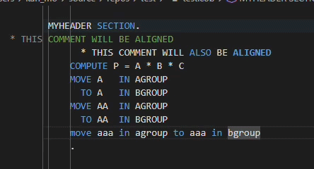

# cobclean 

Formatters for cobol source code.  
 
Exposes the command "cobclean.formatProcedure":

- Formats the contents of the current procedure/paragraph
  - Current procedure is identified by current cursor position
  - Only changes the contents of the current procedure 
- Uppercases anything not within string literals (since most cobol compilers treat upper/lowercase differently only when within string literals)
- Indents any source lines to margin 2 if they contain non-whitespace chars before margin 2
- Indents comments (lines beginning with *) 
- Indents move statements 
  - Matches position of IN keyword to be aligned column-wise
  - Matches the arg name for MOVE and TO to be aligned column-wise
